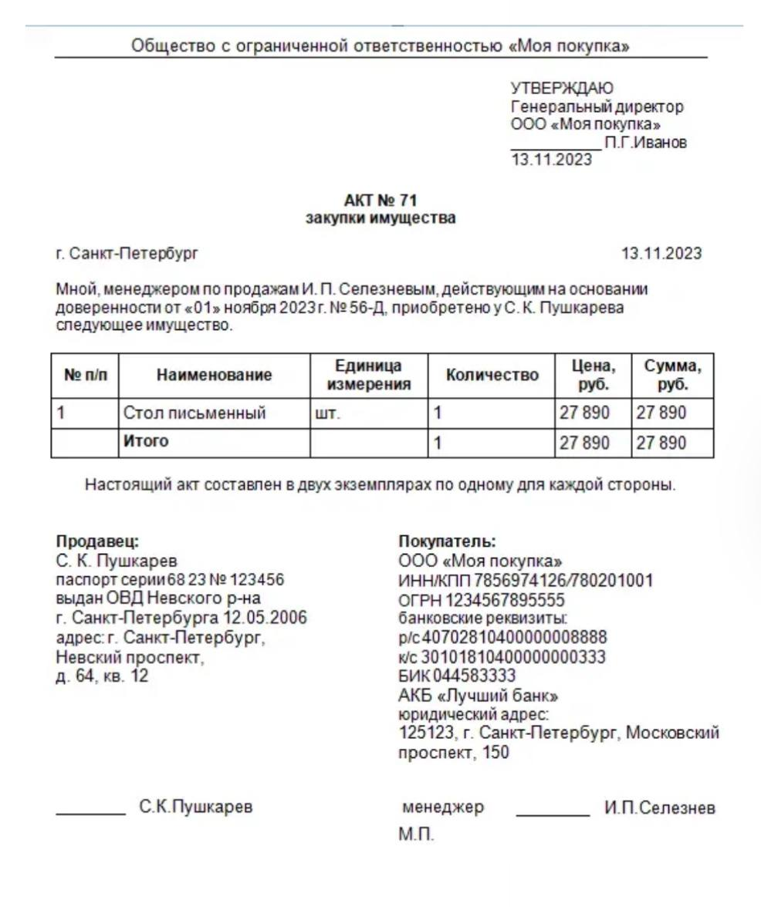

Баженова Виктория Димтриевна

ИП-24-4

## Пример акта

Создано 5 сущностей: `Act`, `ActItem`, `Seller`, `Buyer`, `Employee` с полями согласно примеру акта.

Все сущности наследуются от `BaseAuditEntity`

